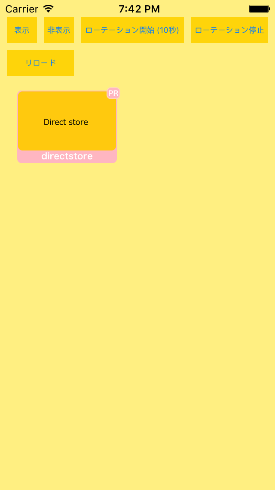
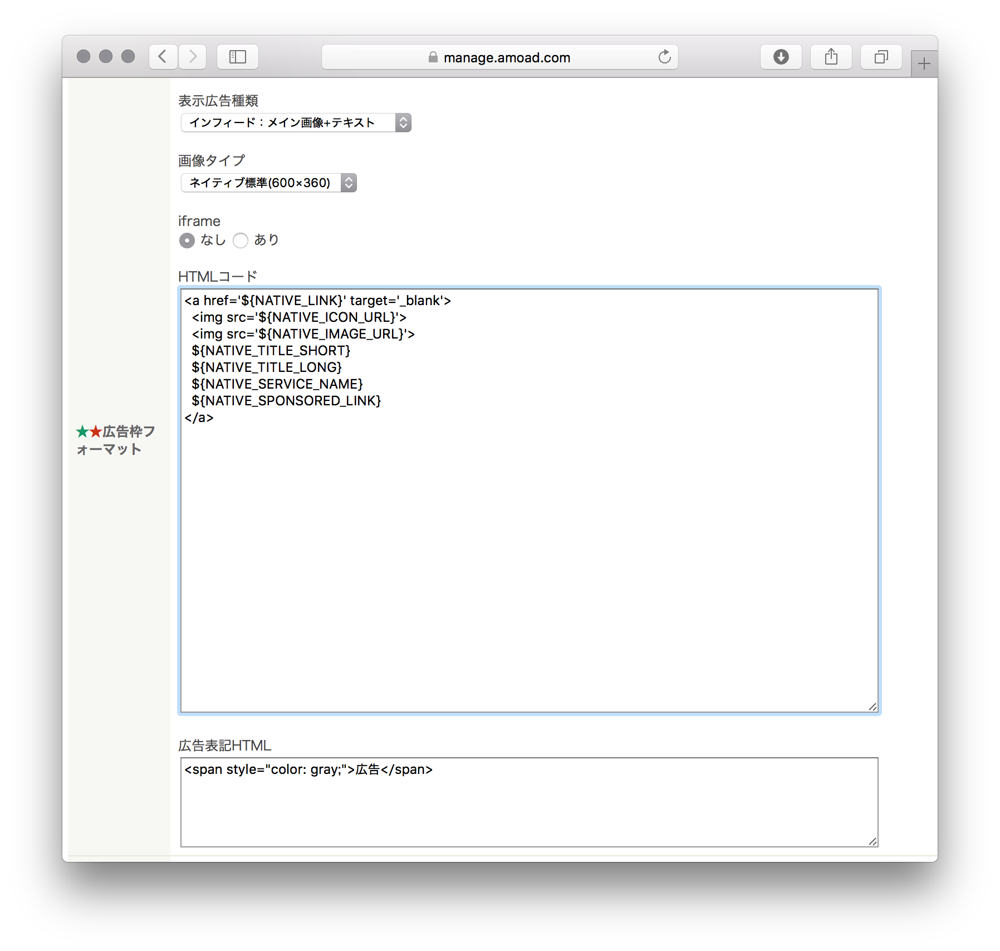
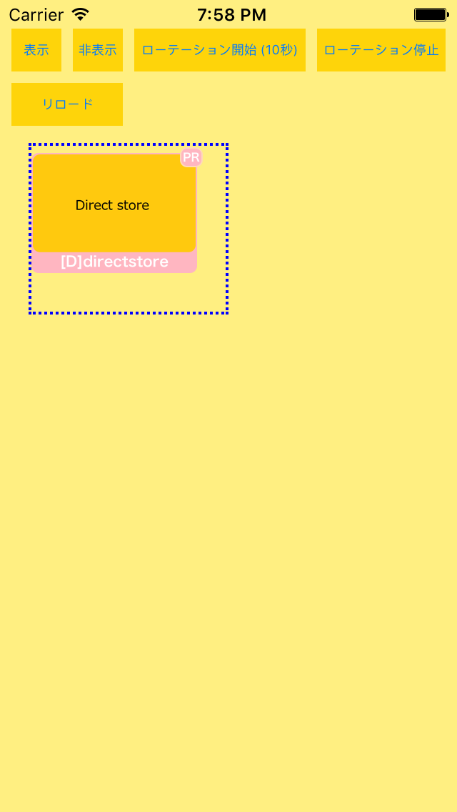
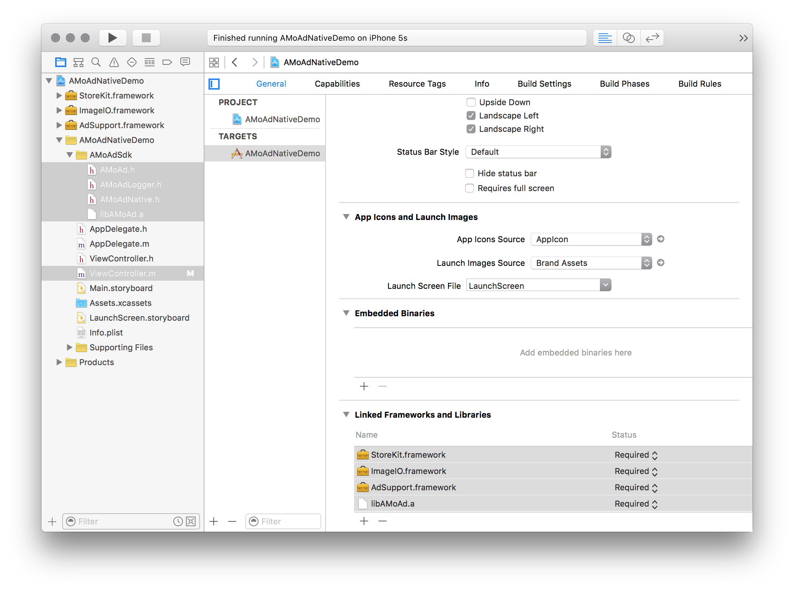

<div align="center">

</div>

# AMoAd Native Demo for iOS ver 5.2.2




## Introduction

ネイティブ広告のスタイルを管理画面よりHTML+CSSでデザインできます（HTMLコードの画面キャプチャは例です。実際にはアプリのデザインに合わせたコードを書きます）。

## Requirements

iOS 8.0 or later

## Installing

[ZIPをダウンロード](https://github.com/amoad/amoad-native-ios-sdk/archive/master.zip)

## Usage

管理画面から取得したsidをViewController.mのkSidに設定する。tagは複数の広告を区別するための任意文字列です。

```objc
// [SDK] 管理画面から取得したsidを入力してください
static NSString *const kSid = @"62056d310111552c000000000000000000000000000000000000000000000000";
static NSString *const kTag = @"Ad01";
```

loadメソッドに以下のJSON文字列を渡すことで、広告の枠線を表示することができます。



```objc
[AMoAdNative loadWithSid:kSid tag:kTag frame:frame completion:^(NSString *sid, NSString *tag, AMoAdResult result, NSDictionary *serverInfo) {
  // コールバック処理
} option:@{ @"border" : @"dotted 2px #0000ff"}];  // DEBUG 枠線が表示されます
```

## API

[AMoAd Native API](AMoAdNativeDemo/AMoAdNativeDemo/AMoAdSdk/AMoAdNative.h)

[AMoAd Logger API](AMoAdNativeDemo/AMoAdNativeDemo/AMoAdSdk/AMoAdLogger.h) 
 ... [ログ出力設定](https://github.com/amoad/amoad-ios-sdk/wiki/Logger)


## Project Settings

### 設定例

ATS (App Transport Security) に対応しました。ATSを抑制する設定は不要になりました。



